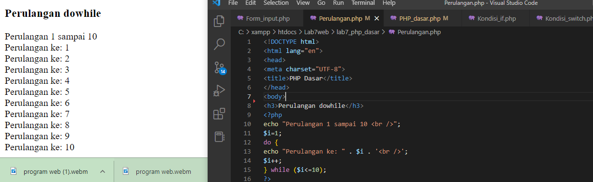

# Lab7web
# Lab7Web
## Belajar PHP Dasar

### Menjalankan Web server
Pertama, kita harus menjalankan web server yang ada di XAMPP control begini tampilannya:

### Memulai PHP
Kedua, memulai PHP dengan membuat folder lab7_php_dasar lalu kita dapat mengakses directory tersebut pada web dengan URL http://localhost/Lab7Web/lab7_php_dasar/. karena file lab7_php_dasar saya tersimpan di Lab7Web begini tampilannya:

Lalu, berikutnya membuat file lagi dengan nama php_dasar.php dengan kode dan dapat diakses dengan URL http://localhost/Lab7Web/lab7_php_dasar/php_dasar.php yang tertampil sebagai berikut:

### Variable PHP
Berikutnya kita menambahkan variable pada program sebagai berikut:

### Predefine Variable $_GET
Berikutnya menambahkan variable $_GET lalu cara mengaksesnya dengan URL http://localhost/Lab7Web/lab7_php_dasar/latihan2.php?nama=Desvi. beginilah tampilannya:

### Membuat Form Input
Lalu membuat form input dengan php dengan tampilan berikut:

### Membuat Operator
Membuat operator dengan kode sebagai berikut:

### Kondisi If dan Switch
Membuat kondisi If dan Switch dengan tampilan sebagai berikut:

### Perulangan for, while, dan dowhile
Membuat perulangan dengan kode dan tmapilan sebagai berikut:

